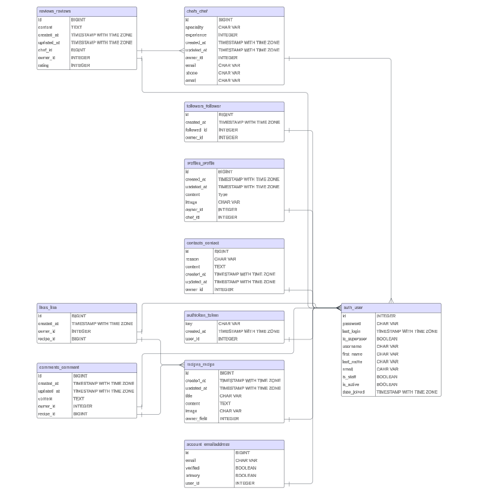

# Bia API
Bia API is the backend server used by the Bia frontend application [Bia - FrontEnd](https://bia-code-institute-00aa55848eed.herokuapp.com/)

## Table of Contents
* [Development Aims](#Development-Aims)
* [Agile Planning](#Agile-Planning)
    * [Epics](#Epics)
    * [User Stories](#User-Stories)
* [API End Points](#API-End-Points)
* [Future Features](#Features-Left-to-Implement)
* [Database Design](#Database-Design)
* [Security](#Security)
* [Technologies](#Technologies)
* [Testing](#Testing)
* [Deployment](#Deployment)
    * [Version Control](#Version-Control)
    * [Heroku Deployment](#Heroku-Deployment)
    * [Run Locally](#Run-Locally)
    * [Fork Project](#Fork-Project)
* [Credits](#Credits)
  * [Content](#Content)
  * [Acknowledgements](#Acknowledgements)

# Development Aims

This APi aims to provide a backend service that will enable the frontend application Bia to perform create, read, update, delete (C.R.U.D.) operations through the user interface (UI).
 

## Agile Planning

This project followed agile methodologies, delivering small features in incremental sprints. There were a total of three sprints, evenly spaced over three weeks.

All user stories were categorized into epics and prioritized with labels such as "Must have," "Should have," and "Could have." The stories were then assigned to specific sprints. The development prioritized "Must have" stories initially, followed by "Should haves," and finally, "Could haves." This sequential approach ensured the completion of essential requirements first, providing a comprehensive project foundation. Additional, desirable features were added based on available capacity.

The project utilized a Kanban board created on GitHub Projects, accessible here(link). For more detailed information on project cards, the Kanban board can be referenced. All stories, excluding documentation tasks, were equipped with a comprehensive set of acceptance criteria, serving as benchmarks to determine the completion status of each story.

 

### Epics

#### Setup:

This Epic encompasses the initial configuration of the Django application and Django REST Framework, laying the groundwork for the commencement of feature development.

#### Recipe:

This Epic focuses on the creation of API endpoints and database connections essential for implementing CRUD functionality related to user recipes. This also encompasses activities such as liking recipes.

#### Comments:

This Epic addresses the creation of API endpoints and database connections necessary for the implementation of CRUD functionality for user comments, specifically in relation to recipes.

#### Profiles:

This Epic entails the creation of API endpoints and database connections required for the CRUD functionality associated with user profiles, including features such as following other users.

#### Chefs:

This Epic involves the creation of API endpoints and database connections essential for implementing CRUD functionality for users registering as Chefs.

#### Reviews:

This Epic covers the creation of API endpoints and database connections related to the CRUD functionality of recipe reviews, including the calculation of average ratings displayed on user profiles.

 

## User Stories

### Epics

#### Setup

- As a developer, I need to establish the foundational project setup to facilitate further development.

#### User Authenication

- As a user, I want to register for a new account to gain access to all available features

#### Chefs

- As a developer, I aim to implement API views for chefs to ensure their data is accessible from the frontend.

#### Contact

- As a developer, I want to create a contact model and corresponding API view to enable users to reach out to the site owner with any issues or concerns.

#### Recipes

- As a user, I want the capability to view, edit, or delete recipes.
- As a user, I want the ability to create recipes and view a list of existing posts.

#### Profiles

- As a developer, I aim to automatically generate a new profile with a default image for each user upon registration.
- As a user, I want the ability to access a list of profiles registered on the platform.

## API Endpoints

User Story:

`As a developer, I need to establish the foundational project setup to facilitate further development.`

Implementation:

The foundational project was created along with a virtual environment including all neccessary packages which were then frozen into the requirements.

Secret variables were modified to hide any sensitive information and set dev and production environments apart.

User Story:

`As a user, I want to register for a new account to gain access to all available features`

Implementation:

Django Rest Framework and dj_rest_auth were installed and integrated into the project's URL patterns and site packages to leverage their built-in authentication system.

User Story:

`As a developer, I aim to implement API views for chefs to ensure their data is accessible from the frontend.`

Implementation:

Endpoint: /chefs/

Methods:

* POST - Used to create a chef
* GET - Used to retrieve a list of chefs

Endpoint: /chefs/int:pk/

Methods:

* GET - Used to view a single chef's profile
* PUT - Used to update a chefs's profile
* DELETE - Used to delete a chef's profile

User Story:

` As a developer, I want to create a contact model and corresponding API view to enable users to reach out to the site owner with any issues or concerns.`

Implementation:

Endpoint: /contacts/

Methods:

* POST - Used to create contact request
* GET - Used to get a list of contact requests

Endpoint: /contacts/int:pk/

Methods:

* GET - Get a single contact request
* PUT - Used to update a single contact request
* DELETE - Used to delete a contact request

User Story:

`As a user, I want the capability to view, edit, or delete recipes.`
`As a user, I want the ability to create recipes and view a list of existing posts.`

Implementation:

Endpoint: /recipes/

Methods:

* POST - Used to create recipe
* GET - Used to get a list of recipes

Endpoint: /recipes/int:pk/

Methods:

* GET - Get a single receipe
* PUT - Used to update a single recipe
* DELETE - Used to delete a recipe

User Story:

`As a developer, I aim to automatically generate a new profile with a default image for each user upon registration.`

A signal was implemented within the profiles app to automatically generate a new user profile upon registration.

User Story:

`As a user, I want the ability to access a list of profiles registered on the platform.`

Implentation:

Endpoint: /profiles/

Methods:

* POST - Used to create a profile
* GET - Used to get a list of profiles

Endpoint: /profiles/int:pk/

Methods:

* GET - Get a single profile
* PUT - Used to update a single profile
* DELETE - Used to delete a profile

 

## Database Design

## Security

A permissions class named IsOwnerOrReadOnly was implemented to restrict editing or deletion of content to its creator, ensuring that only users who create the content have the privilege to modify or remove it.

## Technologies

* Django
  * Framework used to create application
* Django REST Framework
  * Framework used for creating the API
* Cloudinary
  * Used to host static images
*  Heroku
  * Used to host the application
* Git
  * Used for verion control
* Github
  * Repository used for storing code and docs

 

## Python Packages

## Testing

Local testing of the APIs was conducted during development, while comprehensive testing was performed as an integral part of the front-end repositories. Manual testing involved interaction with the real APIs through form inputs and page loads. 

The test outcomes are documented in frontend ReadMe: [Bia](https://github.com/danny-fla/bia)

**Validator Results**

All folders underwent flake8 testing, revealing several issues such as lines being too long, excessive blank spaces, incorrect indentation, and missing docstrings.

All identified issues were addressed, except for the lines being too long in migration files (as these are auto-generated and not easily modified) and the auth validator lines in settings.py, which appear unbreakable due to being framework code.

A warning about env.py being imported but unused was disregarded, as it is utilized in the development version despite not being utilized elsewhere.

[Chefs](./readme/flake8-chefs.png)

[Contacts](./readme/flake8-contacts.png)

[Comments](./readme/flake8-comments.png)

[Followers](./readme/flake8-followers.png)

[Profiles](./readme/flake8-profiles.png)

[Recipe](./readme/flake8-recipe.png)

[Likes](./readme/flake8-like.png)

[Reviews](./readme/flake8-reviews.png)

## Deployment

### Version Control

`git add <file>` This command stages changes in the specified file(s) to the staging area, preparing them to be committed.

`git commit -m "commit message"` This command creates a commit with the changes staged in the staging area. The -m flag allows you to specify a commit message describing the changes.

`git push` This command sends the committed changes from the local repository to the remote repository updating the remote repository with the latest changes.

### Heroku Deployment

The Bia API is deployed to Heroku, using an ElephantSQL Postgres database. To duplicate deployment to Heroku, follow these steps:

- Fork or clone this repository in GitHub.
- You will need a Cloudinary account to host user profile images.
- Login to Cloudinary.
- Copy the value of the 'API Environment variable' from the part starting cloudinary:// to    the end. You may need to select the eye icon to view the full environment variable. Paste this value somewhere for safe keeping as you will need it shortly (but destroy after deployment).
- Log in to Heroku.
- Select 'Create new app' from the 'New' menu at the top right.
- Enter a name for the app and select the appropriate region.
- Select 'Create app'.
- Select 'Settings' from the menu at the top.
- Login to ElephantSQL.
- Click 'Create new instance' on the dashboard.
- Name the 'plan' and select the 'Tiny Turtle (free)' plan.
- Select 'select region'.
- Choose the nearest data centre to your location.
- Click 'Review'.
- Go to the ElephantSQL dashboard and click on the 'database instance name' for this project.
- Copy the ElephantSQL database URL to your clipboard (this starts with postgres://).
- Return to the Heroku dashboard.
- Select the 'settings' tab.
- Locate the 'reveal config vars' link and select.
- Enter the following config var names and values:
    - CLOUDINARY_URL: your cloudinary URL as obtained above
    - DATABASE_URL: your ElephantSQL postgres database URL as obtained above
    - SECRET_KEY: your secret key
    - ALLOWED_HOST: the url of your Heroku app (but without the https:// prefix)
- Select the 'Deploy' tab at the top.
- Select 'GitHub' from the deployment options and confirm you wish to deploy using GitHub. You may be asked to enter your GitHub password.
- Find the 'Connect to GitHub' section and use the search box to locate your repo.
- Select 'Connect' when found.
- Optionally choose the main branch under 'Automatic Deploys' and select 'Enable Automatic Deploys' if you wish your deployed API to be automatically redeployed every time you push changes to GitHub.
- Find the 'Manual Deploy' section, choose 'main' as the branch to deploy and select 'Deploy Branch'.
- Your API will shortly be deployed and you will be given a link to the deployed site when the process is complete.

#### Run locally

To clone the GitHub repository for local use, follow these steps:

- Navigate to the GitHub Repository you want to clone.
- Click on the "Code" drop-down button.
- Select "HTTPS" from the options.
- Copy the repository link to the clipboard.
- Open your preferred IDE (ensure Git is installed for the next steps).
- In the IDE terminal, type git clone <copied-git-url>.
- Press Enter to execute the command.

The project will now be cloned onto your local machine for use.
To run the project, you'll need to create an env.py file and add the configuration variables as used in the Heroku steps mentioned above.

**Virtual Environment Setup**

Windows:

`python -m venv venv`
`venv/Scripts/activate`
`pip install -r requirements.txt`

Mac:

`python -m venv venv`
`source venv/bin/activate`
`pip install -r requirements.txt`

#### Forking

Forks are typically utilized for either suggesting modifications to another person's project or for employing someone else's project as a foundation for your own concept.

Here's how to fork a GitHub Repository:

- Navigate to the GitHub Repository you wish to fork.
- At the top right of the page, beneath the header, locate and click the "fork" button.
- This action will generate a duplicate of the entire project within your GitHub Repository.

## Credits
- The fix for the Django Rest Framework bug that prevents user's cookies from being cleared on logout is from the Code Institute Django Rest Framework walkthrough project
- The technique to limit the size of image uploads to cloudinary is adapted from this [Cloudinary](https://support.cloudinary.com/hc/en-us/community/posts/360009752479-How-to-resize-before-uploading-pictures-in-Django) support article 
- I learned how to implement a rating system into my reviews app by watching a [tutorial](https://www.youtube.com/watch?v=D3iPIoTL9sk) video on YouTube.